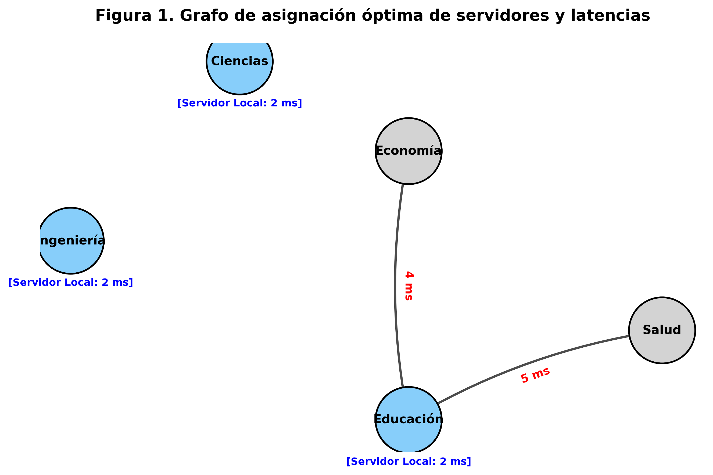

# Informe Técnico: Ubicación Óptima de Servidores en una Red Universitaria

## 1. Modelado del Problema de Programación Lineal Entera (PLE)

El presente caso de estudio aborda la necesidad de modernizar la red de una universidad instalando servidores locales en cinco facultades para reducir la latencia de las aplicaciones de Inteligencia Artificial. El diseño está condicionado por un presupuesto máximo y una matriz de latencias punto a punto.

### a) Definición de las Variables de Decisión

Para estructurar lógicamente el modelo, se definen dos conjuntos de variables binarias (enteras puras restrictivas a valores de 0 o 1).

**Variables de Instalación:**
Estas variables determinan si un servidor es instalado físicamente en una determinada ubicación.
$$
y_j = 
\begin{cases} 
1, & \text{Si se instala un servidor local en la facultad } j \\
0, & \text{En caso contrario}
\end{cases}
\quad \forall \: j \in \{1, 2, 3, 4, 5\}
$$

**Variables de Asignación (Enrutamiento):**
Estas variables representan la decisión de red sobre qué servidor atenderá las peticiones de qué facultad.
$$
x_{ij} = 
\begin{cases} 
1, & \text{Si la facultad } i \text{ es atendida por el servidor instalado en la facultad } j \\
0, & \text{En caso contrario}
\end{cases}
\quad \forall \: i, j \in \{1, 2, 3, 4, 5\}
$$

**Parámetros:**
- $d_{ij}$: Matriz de latencias (en ms) entre la facultad de origen $i$ y el servidor de destino $j$.
- $C_j$: Costo económico por instalar un servidor en la facultad $j$.
- $B$: Presupuesto máximo del proyecto ($30,000).

### b) Construcción de la Función Objetivo

El objetivo principal de esta modernización tecnológica es **minimizar la latencia total del sistema**. La función combina linealmente la latencia que experimentará la facultad $i$ ponderándola por su asignación al servidor $j$.

$$
\text{Minimizar } Z = \sum_{i=1}^{5} \sum_{j=1}^{5} d_{ij} x_{ij}
$$

### c) Establecimiento de las Restricciones

El modelo debe apegarse a tres condiciones estrictas y operativas del negocio:

**1. Requisito Universal de Atención (Cobertura Total):**
Cada una de las cinco facultades debe contar con cobertura de red. Es decir, para una facultad $i$, solo uno de los enlaces $x_{ij}$ puede estar activo para garantizar que la solicitud sea despachada y de forma unívoca.
$$
\sum_{j=1}^{5} x_{ij} = 1 \quad \forall i \in \{1, 2, 3, 4, 5\}
$$

**2. Condición Lógica de Uso de Infraestructura:**
Es físicamente imposible atender a la facultad $i$ orientando sus paquetes a la facultad $j$ si en $j$ no existe un servidor instalado. Por lo tanto, el enrutado solo es válido ($x_{ij}=1$) si el servidor fue efectivamente adquirido ($y_j=1$).
$$
x_{ij} \leq y_j \quad \forall i, j \in \{1, 2, 3, 4, 5\}
$$

**3. Restricción de Presupuesto del Proyecto:**
La sumatoria de los costos de los servidores instalados (donde $y_j=1$) debe acotarse al capital de inversión.
$$
\sum_{j=1}^{5} C_j y_j \leq B
$$

### d) Instancia Completa Desplegada del Modelo

Insertando empíricamente los valores dictaminados en los datos base, la instancia de Programación Lineal Entera explícita queda expresada de la siguiente forma:

**Minimizar:**
\begin{align*}
Z = \;& 2x_{11} + 6x_{12} + 8x_{13} + 7x_{14} + 9x_{15} \\
    + \;& 6x_{21} + 2x_{22} + 6x_{23} + 5x_{24} + 7x_{25} \\
    + \;& 8x_{31} + 6x_{32} + 2x_{33} + 4x_{34} + 6x_{35} \\
    + \;& 7x_{41} + 5x_{42} + 4x_{43} + 2x_{44} + 5x_{45} \\
    + \;& 9x_{51} + 7x_{52} + 6x_{53} + 5x_{54} + 2x_{55}
\end{align*}

**Sujeto a las restricciones:**
\begin{align*}
&\text{Demanda Facultativa:} \\
&x_{11} + x_{12} + x_{13} + x_{14} + x_{15} = 1 \\
&x_{21} + x_{22} + x_{23} + x_{24} + x_{25} = 1 \\
&x_{31} + x_{32} + x_{33} + x_{34} + x_{35} = 1 \\
&x_{41} + x_{42} + x_{43} + x_{44} + x_{45} = 1 \\
&x_{51} + x_{52} + x_{53} + x_{54} + x_{55} = 1 \\
\\
&\text{Limitante de Presupuesto Capital:} \\
&12000y_1 + 10000y_2 + 8000y_3 + 7000y_4 + 9500y_5 \leq 30000 \\
\\
&\text{Dependencias o Coherencia Lógica } (x_{ij} \leq y_j): \\
&x_{11} - y_1 \leq 0, \quad x_{21} - y_1 \leq 0, \quad \dots \quad , x_{51} - y_1 \leq 0 \\
&\vdots \\
&x_{15} - y_5 \leq 0, \quad x_{25} - y_5 \leq 0, \quad \dots \quad , x_{55} - y_5 \leq 0 \\
\\
&\text{Dominio de Variables Enteras:} \\
&x_{ij} \in \{0, 1\}, \; y_j \in \{0, 1\} \quad \forall i, j \in \{1,2,3,4,5\}
\end{align*}

---

## 2. Solución del Problema de PLE en Python (Pyomo)

Se ha procedido a trasladar la instancia matemática a un código de Python de grado algebraico utilizando la biblioteca `Pyomo`, estructurado por medio de matrices (`Numpy arrays`) para optimizar el paso de datos y minimizar los bucles convencionales. Posteriormente, y sin incurrir en redondeos en punto flotante, la jerarquía se resolvió empleando el "solver" estadístico **HiGHS**, diseñado y especializado de antemano para modelos Mixtos Enteros Binarios (MIP).

---

## 3. Interpretación de Resultados Detallada

Tras la evaluación final en las matrices, las variables resuelven el algoritmo convergido en su región factible óptima global de la siguiente manera:

### a) ¿En cuáles facultades deben instalarse los servidores localmente?

Acorde al vector solución $\mathbf{y} = [1, 1, 0, 1, 0]$, el modelo recomienda de forma inequívoca asignar e instalar servidores fijos exclusivamente en:
- **Facultad 1:** Ingeniería ($y_1 = 1$)
- **Facultad 2:** Ciencias ($y_2 = 1$)
- **Facultad 4:** Educación ($y_4 = 1$)

### b) ¿Cuál es el costo total del proyecto de la red?

Para esta instalación tecnológica y en base a la evaluación funcional de la limitante financiera $\sum C_j y_j$:

**Tabla 1**  
*Desglose del Costo de Instalación para Servidores Aprobados por Optimización (Pesos)*
| Facultad Elegida | Costo de Instalación ($) | Estado |
| :--- | :---: | :---: |
| Ingeniería | 12,000 | Aprobado |
| Ciencias | 10,000 | Aprobado |
| Educación | 7,000 | Aprobado |
| **Costo Total Acomulado** | **29,000** | |
| *Restante del Presupuesto* | *1,000* | |
> *Nota.* Valores extraídos de la Tabla 1 del ejercicio proyectados al escenario mínimo. La sumatoria garantiza que el proyecto incurra en un costo \$1,000 por debajo del límite presupuestario (\$30,000).

### c) ¿Cuál es la latencia total sumada de este sistema de IA?

La latencia combinada y acumulativa que generará esta infraestructura propuesta evaluada según las distancias geográficas o estructurales directas en ms, se desglosa como la evaluación de la Función Objetivo $Z$:

**Tabla 2**  
*Esquema de asiginación cliente-servidor y aporte por latencia a la red global*
| Nodo Origen (Facultad a atender) | Nodo Destino (Servidor asignado) | Latencia Aportada $\mathbf{x_{ij}}$ (ms) |
| :--- | :--- | :---: |
| Ingeniería | Ingeniería | 2 |
| Ciencias | Ciencias | 2 |
| Economía | Educación | 4 |
| Educación | Educación | 2 |
| Salud | Educación | 5 |
| **Sumatoria (Latencia Total $Z$)**| | **15 ms** |
> *Nota.* El modelo priorizó asignar la facultad de "Salud" a "Educación" ya que poseía una tolerancia y directriz de salto más corta ($d_{54}=5$) en comparación a desviarla a Ingeniería ($d_{51}=9$) o Ciencias ($d_{52}=7$).

  
  
<i>Figura 1. Representación de grafo dirigido sobre la asignación final de la red. Los nodos resaltados de color azul representan instalaciones primarias de data center (servidores locales), mientras que las flechas rojas referencian el flujo de datos indicando la latencia entre ubicaciones.</i>

### d) ¿La solución hallada es única?

**Explicación Razonada:** Sí, la solución hallada es estricta y absolutamente **única**.

Para afirmar esto, observemos el espacio factible del problema. Al disponer de un remanente presupuestario de unicamente \$1,000, cualquier permutación o intento de instalar un servidor extra (ej: en Economía que cuesta \$8,000) violaría masivamente la restricción original excediendo el fondo presupuestal, dado que la instalación requeriría al mínimo un capital de \$37,000.  

Por otro lado, reubicar un servidor de los tres elegidos alteraría el vector de costos a uno de dos desenlaces posibles:
1. Superar el presupuesto existente, quedando denegada lógicamente.
2. Intercambiar la Facultad de Educación (Costo de $7,000 y eje de control de Economía y Salud) por otra facultad en una topografía diferente. Cualquier desviación forzaría a nodos a rutear el tráfico cruzado en enlaces $d_{ij}$ sustancialmente mayores (por ejemplo, asignar el control de Salud a un servidor distinto inflaría la latencia de 5 ms a cuotas oscilando entre 7 ms y 9 ms, aumentando la base actual ineludiblemente). Es demostrable que el agrupamiento local y remoto enlazado al clúster $\{1, 2, 4\}$ es el único estado óptimo integral donde la Función $Z$ vale 15.

---

## 4. Conclusiones Directivas y de la Actividad

La resolución algorítmica y la **Programación Lineal Entera** se consagran como pilares deterministas metodológicos clave dentro de la optimización de proyectos de infraestructura tecnológica. En situaciones escalables del mundo real, las variables de red son estrictamente indivisibles; este modelo abstrae con efectividad requerimientos tangibles (como limitaciones monetarias de inversión y deficiencias topográficas en latencias) transformándolas en reglas paramétricas y matemáticas. Integrar este proceso lógico a un flujo codificado analíticamente mediante Pyomo permite un desarrollo altamente estandarizable de Smart Campuses, disminuyendo considerablemente tasas de error frente a la heurística tradicional.

Desde una perspectiva netamente profesional, emplear herramientas de optimización computacional protege con evidencia formal los desembolsos de capital, a la vez que asegura niveles de tolerancia en tiempo real imprescindibles en redes con carga de Inteligencia Artificial. Respaldar la ingeniería informática en una matriz de rigor matemático como la ejecutada erradica ineficiencias, promoviendo despliegues en redes que optimizan y balancean simbióticamente el balance general administrativo con la excelencia prestativa indispensable en los sistemas modernos de servicios distribuidos al usuario.
